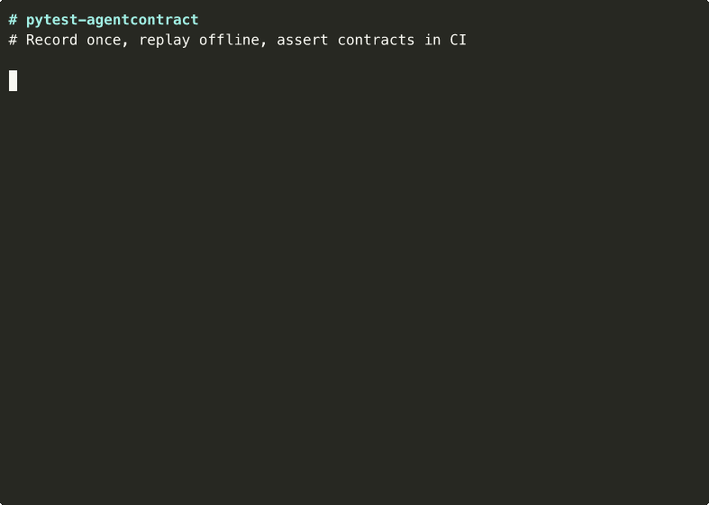

# pytest-agentcontract

**Deterministic CI tests for LLM agent trajectories.** Record once, replay offline, assert contracts.

[](https://pypi.org/project/pytest-agentcontract/)
[](https://github.com/mikiships/pytest-agentcontract/actions)
[](https://opensource.org/licenses/MIT)
[](https://www.python.org/downloads/)

---

<p align="center">
  
</p>

Your agent calls `lookup_order`, then `check_eligibility`, then `process_refund`. Every time. That's the contract. Test it like any other interface.

```bash
# Record a trajectory (hits real APIs once)
pytest --ac-record

# Replay in CI forever (no network, no API keys, no cost, deterministic)
pytest --ac-replay
```

```
tests/scenarios/refund-eligible.agentrun.json
├── turn 0: user → "I want a refund for order 123"
├── turn 1: assistant → lookup_order(order_id="123")
├── turn 2: assistant → check_eligibility(order_id="123")
├── turn 3: assistant → process_refund(order_id="123", amount=49.99)
└── turn 4: assistant → "Your refund of $49.99 has been processed."
```

## Install

```bash
pip install pytest-agentcontract
```

With auto-recording interceptors:
```bash
pip install pytest-agentcontract[openai]      # OpenAI SDK
pip install pytest-agentcontract[anthropic]    # Anthropic SDK
pip install pytest-agentcontract[all]          # Everything
```

Framework adapters (LangGraph, LlamaIndex, OpenAI Agents SDK) are included -- no extras needed.

## Quick Start

### 1. Write a test

```python
@pytest.mark.agentcontract("refund-eligible")
def test_refund_flow(ac_recorder, ac_mode, ac_replay_engine, ac_check_contract):
    if ac_mode == "record":
        # Runs your real agent, records the trajectory
        run_my_agent(ac_recorder)
    elif ac_mode == "replay":
        # Replays from cassette -- no network, no tokens
        result = ac_replay_engine.run()

    contract = ac_check_contract(ac_recorder.run)
    assert contract.passed, contract.failures()
```

### 2. Record once

```bash
pytest --ac-record -k test_refund_flow
# Creates tests/scenarios/refund-eligible.agentrun.json
```

### 3. Replay in CI

```bash
pytest --ac-replay
# Deterministic. No API keys. No flakes. Sub-second.
```

## SDK Auto-Recording

Intercept real SDK calls instead of manually building turns:

```python
from agentcontract.recorder.interceptors import patch_openai

def test_with_real_agent(ac_recorder):
    client = openai.OpenAI()
    unpatch = patch_openai(client, ac_recorder)

    # Every chat.completions.create call is recorded automatically
    response = client.chat.completions.create(
        model="gpt-4o",
        messages=[{"role": "user", "content": "Refund order 123"}],
        tools=[...],
    )
    unpatch()
```

Works with Anthropic too:
```python
from agentcontract.recorder.interceptors import patch_anthropic

unpatch = patch_anthropic(client, ac_recorder)
```

## Framework Adapters

Drop-in recording for popular agent frameworks:

```python
# LangGraph
from agentcontract.adapters import record_graph
unpatch = record_graph(compiled_graph, recorder)
result = compiled_graph.invoke({"messages": [("user", "I need a refund")]})
unpatch()

# LlamaIndex
from agentcontract.adapters import record_agent
unpatch = record_agent(agent, recorder)
response = agent.chat("What's the refund policy?")
unpatch()

# OpenAI Agents SDK
from agentcontract.adapters import record_runner
unpatch = record_runner(recorder)
result = Runner.run_sync(agent, "Help with billing")
unpatch()
```

## Configuration

`agentcontract.yml` in your project root:

```yaml
version: "1"

scenarios:
  include: ["tests/scenarios/**/*.agentrun.json"]

replay:
  stub_tools: true

defaults:
  assertions:
    - type: contains
      target: final_response
      value: "refund"
    - type: called_with
      target: "tool:process_refund"
      schema:
        order_id: "123"

policies:
  - name: allowed-tools
    type: tool_allowlist
    tools: [lookup_order, check_eligibility, process_refund]

  - name: confirm-before-refund
    type: requires_confirmation
    tools: [process_refund]
```

Generate a starter config:
```bash
agentcontract init
```

## Assertions

| Type | What It Checks |
|------|---------------|
| `exact` | Exact string match |
| `contains` | Substring present |
| `regex` | Pattern match |
| `json_schema` | JSON Schema validation on tool args/results |
| `not_called` | Tool was NOT invoked |
| `called_with` | Tool called with specific arguments |
| `called_count` | Exact invocation count |

## Policies

| Policy | What It Enforces |
|--------|-----------------|
| `tool_allowlist` | Only listed tools may be called |
| `requires_confirmation` | Protected tools must follow user confirmation |

## Target Syntax

- `final_response` -- last assistant message
- `turn:N` -- specific turn by index
- `full_conversation` -- all turns concatenated
- `tool_call:function_name:arguments` -- tool call arguments
- `tool_call:function_name:result` -- tool call result

## CLI

```bash
agentcontract info cassette.agentrun.json       # Cassette summary
agentcontract validate cassette.agentrun.json   # Structure check
agentcontract init                               # Starter config
```

## Why Not VCR / pytest-recording?

VCR records **HTTP requests**. This records **agent decisions**.

- VCR: "did the HTTP request match?" -- brittle, breaks on any provider API change
- agentcontract: "did the agent call the right tools with the right args?" -- tests actual behavior

Your agent's contract is: given this input, it calls these tools in this order with these arguments. That's what you want to regression-test, not the HTTP layer underneath.

## How It Works

```
┌─────────┐     ┌──────────┐     ┌───────────────┐
│  pytest  │────▶│ Recorder │────▶│ .agentrun.json│
│ --record │     │          │     │  (cassette)   │
└─────────┘     └──────────┘     └───────┬───────┘
                                         │
┌─────────┐     ┌──────────┐             │
│  pytest  │────▶│  Replay  │◀────────────┘
│ --replay │     │  Engine  │
└─────────┘     └────┬─────┘
                     │
                ┌────▼─────┐
                │Assertion │──▶ pass / fail
                │ Engine   │
                └──────────┘
```

1. **Record**: Run your agent against real APIs. The recorder captures every turn, tool call, argument, and result into a `.agentrun.json` cassette.
2. **Replay**: The replay engine feeds recorded tool results back. No network. No tokens. Deterministic.
3. **Assert**: The assertion engine checks contracts -- tool sequences, argument schemas, response content, policies.

## License

MIT
