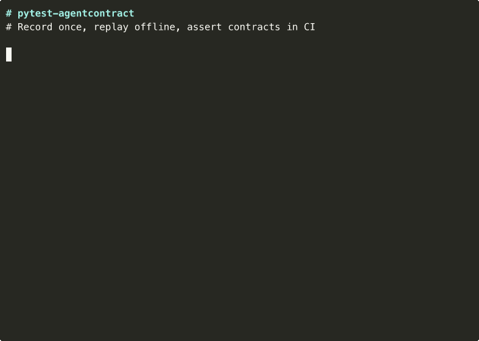

# pytest-agentcontract

**Deterministic CI tests for LLM agent trajectories.** Record once, replay offline, assert contracts.

[](https://pypi.org/project/pytest-agentcontract/)
[](https://github.com/mikiships/pytest-agentcontract/actions)
[](https://opensource.org/licenses/MIT)
[](https://www.python.org/downloads/)

---

<p align="center">
  
</p>

In the bundled customer support example, the agent calls `lookup_order`, then `check_refund_eligibility`, waits for a confirmation turn, and only then calls `process_refund`. That's the contract. Test it like any other interface.

```bash
# Record a trajectory (hits real APIs once)
pytest --ac-record

# Replay in CI forever (no network, no API keys, no cost, deterministic)
pytest --ac-replay
```

```text
examples/customer_support/scenarios/refund-eligible.agentrun.json
├── turn 0: user -> "I'd like a refund for order ORD-123 please"
├── turn 1: assistant -> lookup_order(order_id="ORD-123")
├── turn 2: assistant -> check_refund_eligibility(order_id="ORD-123")
├── turn 3: user -> "Yes, please process the refund."
└── turn 4: assistant -> process_refund(order_id="ORD-123", amount=79.99, method="original") + "Your refund of $79.99 has been processed. Refund ID: REF-ORD-123"
```

## Install

```bash
pip install pytest-agentcontract
```

Optional SDK helpers:

```bash
pip install pytest-agentcontract[openai]
pip install pytest-agentcontract[anthropic]
pip install pytest-agentcontract[all]
```

Framework adapters are bundled in the package. Install the framework runtime you already use in your app.

## Quick Start

Write a pytest test, mark it with a scenario name, and feed recorded turns into `ac_recorder`:

```python
import pytest


@pytest.mark.agentcontract("refund-eligible")
def test_refund_flow(ac_recorder, ac_mode, ac_replay_engine, ac_check_contract):
    if ac_mode == "replay" and ac_replay_engine is not None:
        run = ac_replay_engine.recorded_run
    else:
        turns = run_my_agent("I want a refund for order ORD-123")
        for turn in turns:
            ac_recorder.add_turn(
                role=turn["role"],
                content=turn.get("content"),
                tool_calls=turn.get("tool_calls"),
            )
        run = ac_recorder.run

    result = ac_check_contract(run)
    assert result.passed, [failure.message for failure in result.failures()]
```

Record once:

```bash
pytest -k test_refund_flow --ac-record
```

Replay later:

```bash
pytest -k test_refund_flow --ac-replay
```

By default, cassettes are written to and loaded from `tests/scenarios/<scenario>.agentrun.json`. Use `--ac-scenarios PATH` to override that directory.

## Documentation

- [Pytest plugin guide](docs/pytest-plugin.md): CLI flags, markers, fixtures, cassette paths, and replay patterns.
- [Configuration reference](docs/configuration.md): the parsed `agentcontract.yml` schema, defaults, and what the current runtime actually consumes.
- [Customer support example](docs/customer-support-example.md): how to run the bundled example in live, record, and replay modes.

## SDK Auto-Recording

Use SDK interceptors when you want to capture assistant messages and tool-call requests without manually building each turn:

```python
from agentcontract.recorder.interceptors import patch_anthropic, patch_openai
```

- `patch_openai(client, recorder)` wraps `client.chat.completions.create`.
- `patch_anthropic(client, recorder)` wraps `client.messages.create`.

These interceptors record assistant output plus tool-call requests. Tool results still need to be added by your application if you want them in the cassette.

## Framework Adapters

Use the recorder with higher-level frameworks through the bundled adapters:

```python
from agentcontract.adapters import record_agent, record_graph, record_runner
```

- `record_graph(graph, recorder)` wraps LangGraph `invoke()` and `ainvoke()`.
- `record_agent(agent, recorder)` wraps LlamaIndex `chat()`, `achat()`, `query()`, and `aquery()`.
- `record_runner(recorder)` patches the OpenAI Agents SDK `Runner.run()` and `Runner.run_sync()` methods.

## CLI

```bash
agentcontract info examples/customer_support/scenarios/refund-eligible.agentrun.json
agentcontract validate examples/customer_support/scenarios/refund-eligible.agentrun.json
agentcontract init
```

`agentcontract init` writes a starter `agentcontract.yml` in the current directory.

## Why Not VCR / pytest-recording?

VCR records HTTP requests. `pytest-agentcontract` records agent decisions.

- VCR: "did the HTTP request match?"
- agentcontract: "did the agent call the right tools with the right args?"

If the behavior you care about is tool choice, call order, call arguments, and user-visible replies, the contract belongs above the HTTP layer.

## See Also

- [coderace](https://github.com/mikiships/coderace): race coding agents against each other on real tasks in your repo with automated scoring.
